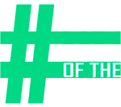

# I AM PART OF THE CURE

The #IAmPartoftheCure is a campaign for the [Regional HIV/AIDS Connection](https://hivaidsconnection.ca/) organization which seeks to reduce stigma and discrimination towards people suffering from HIV / AIDS. 

### Dependencies

* HTML5
* CSS3
* SASS/CSS
* AJAX/JS
* VUE.js
* PHP
* MySQL

### Installing

* cd to the directory of your choice and hack away!

## Authors

DEVELOPERS
* [Dana Marin Garcia](https://github.com/danamaring)
* [Gahyun Lee](https://github.com/Gahyunlee23)

DESIGNERS
* [Alexander Riddick](https://github.com/ariddick117)
* [Hyeryn Kim](https://github.com/hrk9501)
* [Inderjit Singh](https://github.com/inderjitsinghsaini)

## License
* MIT

## Acknowledgments

* [awesome-readme](https://github.com/matiassingers/awesome-readme)
* [README Formatting](https://guides.github.com/features/mastering-markdown/)
* [MeyerWeb CSS Reset](https://meyerweb.com/eric/tools/css/reset/)
* [Vue.js](https://vuejs.org/)
